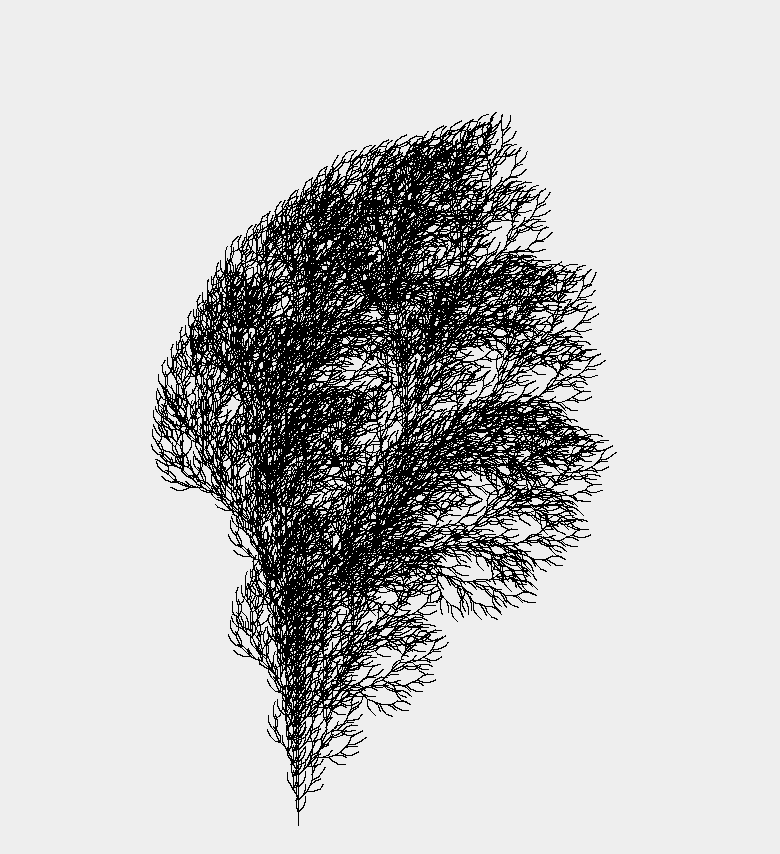

# LSystem
A program that draws random graphics using a Lindenmayer system or L-system . 
Among other things, we want to produce drawings that look like plants (possible application: graphic output of landscape). 
The L-system was invented for this purpose: it allows to model the development of plant structures.

Below is an example of what can be gererated:

